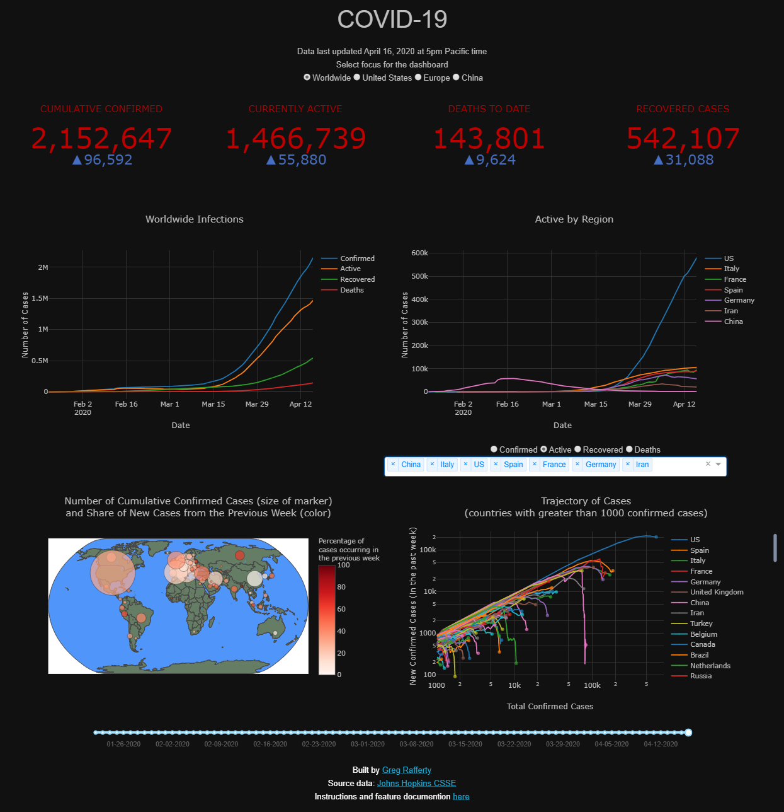
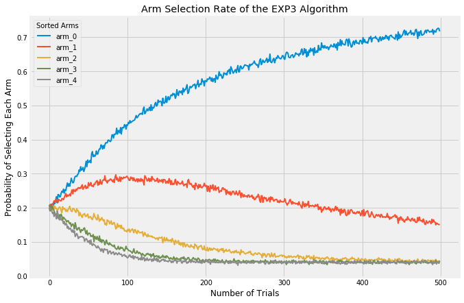
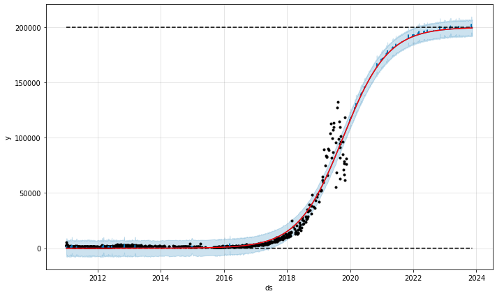
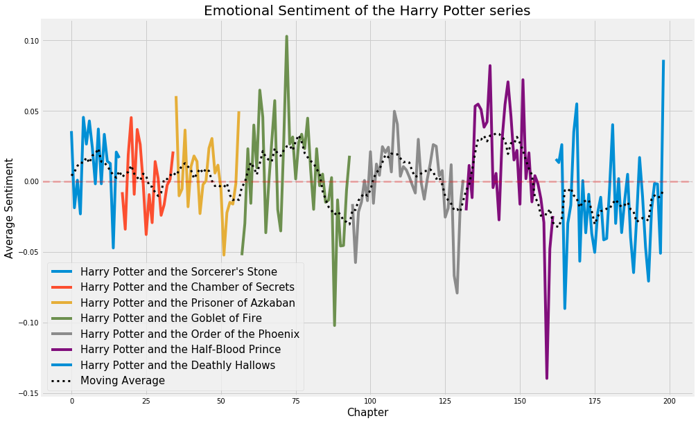
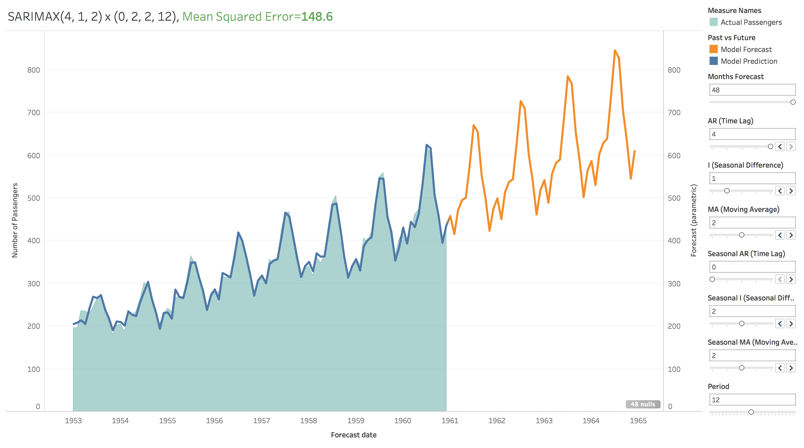
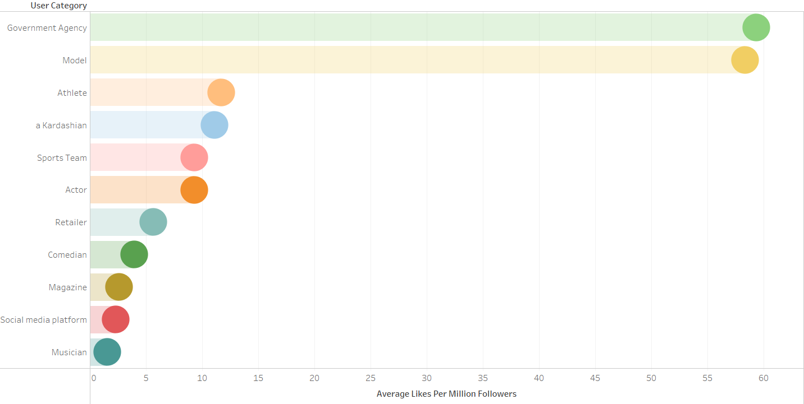
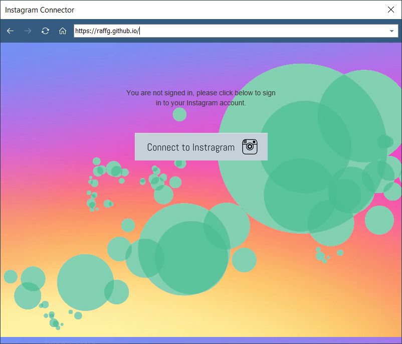

# Portfolio of personal data science projects

### COVID-19 Interactive Web Dashboard
Built an interactive dashboard to monitor the COVID-19 pandemic in three regions: worldwide, United States, and Europe; using Plotly and Dash. Data is updated nightly from a source provided by Johns Hopkins University Center for Systems Science and Engineering. App is live and hosted on Heroku at [covid-19-raffg.herokuapp.com](https://covid-19-raffg.herokuapp.com/).

- [GitHub repo](https://github.com/raffg/covid-19)
- [Web Dashboard](https://covid-19-raffg.herokuapp.com/)
- [Medium post documenting features](https://towardsdatascience.com/covid-19-dashboard-b7f8b7c59431?source=friends_link&sk=052bfd87662775d68c5e8b15efcc8aff)

Technologies used:
Python, Pandas, Plotly, Dash, Heroku

---
### Who's Tweeting from the Oval Office?
Machine learning project to classify if Trump is truly the author of any given tweet on his account, or if it was written and posted by an aide. Deployed via a Twitter bot which predicted in real-time and posted an estimated probability of Trump or an aide being the author of a tweet.

- [GitHub repo](https://github.com/raffg/trump-tweet-author-identification)
- [Twitter bot account](https://twitter.com/whosintheoval) *(no longer active)*
- [Medium post discussing procedure and results](https://towardsdatascience.com/whos-tweeting-from-the-oval-office-96ea5b60c03)
- [Medium post discussing Twitter bot development](https://towardsdatascience.com/whos-tweeting-from-the-oval-office-building-a-twitter-bot-9c602edf91dd)

Technologies used:  
Python, scikit-learn, Pandas, Tweepy, AWS, Twitter API

---
### A/B testing with Multi-Armed Bandits
Project to use several multi-armed bandit algorithms and Monte Carlo simulations to perform Bayesian A/B testing in order to compare the performance of different algorithms under various circumstances.

- [GitHub repo](https://github.com/raffg/multi_armed_bandit)
- [Medium post](https://towardsdatascience.com/a-b-testing-is-there-a-better-way-an-exploration-of-multi-armed-bandits-98ca927b357d?source=friends_link&sk=4635341ddef1ec4bc903e4945966d714)

Technologies used:  
Python, Pandas, Bayesian and classical statistics, Monte Carlo simulations, Matplotlib

---
### Spotify sentiment analysis
Used the Spotify API and web scraping to download the valence scores for all 68,000+ songs in Spotify's Daily Top 200 charts for all available countries and dates and analyzed trends over time and by region. Discovered a mistake made by The Economist during their analysis and notified the editor.

- [GitHub repo](https://github.com/raffg/spotify_analysis)
- [Medium post](https://towardsdatascience.com/whats-the-most-wonderful-time-of-the-year-hint-it-s-not-what-the-economist-says-45d96551b664?source=friends_link&sk=f19e71cf528127960d9dfc0a1146b2d4)

Technologies used:  
Python, Pandas, Spotify API, Spotipy, web scraping, Matplotlib

---
### Forecasting in Python with Facebook Prophet
Used advanced forecasting techniques in Facebook's Prophet package to forecast some tricky edge cases using data from Instagram, Divvy bike share, and annual airline passengers.

- [GitHub repo](https://github.com/raffg/prophet_forecasting)
- [Medium post](https://towardsdatascience.com/forecasting-in-python-with-facebook-prophet-29810eb57e66?source=friends_link&sk=47194056e7c5185c71d599df762b5257)

Technologies used:  
Python, Facebook Prophet, Pandas, forecasting, Instagram API

---
### Harry Potter NLP
Project to use LDA topic modelling, sentiment analysis, and text summarization on the texts of the Harry Potter books.

- [GitHub repo](https://github.com/raffg/harry_potter_nlp)
- Medium posts:
    - [Sentiment analysis](https://towardsdatascience.com/basic-nlp-on-the-texts-of-harry-potter-sentiment-analysis-1b474b13651d)
    - [Topic modeling with Latent Dirichlet Allocation](https://towardsdatascience.com/basic-nlp-on-the-texts-of-harry-potter-topic-modeling-with-latent-dirichlet-allocation-f3c00f77b0f5)
    - [Regular Expression case study](https://towardsdatascience.com/regex-on-the-texts-of-harry-potter-96b8a3878303)
    - [Extractive text summarization](https://towardsdatascience.com/text-summarization-on-the-books-of-harry-potter-5e9f5bf8ca6c)

Technologies used:  
Python, regular expressions, Gensim, spaCy, NLTK, Matplotlib

---
### @Natgeo Instagram anomaly
Discovered a sudden and temporary increase in average likes per photo on National Geographic's Instagram account during August 2016 and investigated the probability that it could be due to random chance using t-tests.

- [GitHub repo](https://github.com/raffg/natgeo_instagram_anomaly)
- [Tableau Public storyboard](https://public.tableau.com/profile/greg4084#!/vizhome/NationalGeographiconInstagram/Storyboard) *(on web)*

Technologies used:  
Python, statsmodels, classical statistics, Seaborn

---
### Forecasting with Python and Tableau
Developed an interactive dashboard implementing Python code within Tableau to build a time-series forecast. Original project was to forecast medicine demand for a client in the pharmaceutical industry but I have anonymized the dashboard here by using the common Air Passengers dataset, in order to demonstrate Tableau's new capability of running Python.

- [GitHub repo](https://github.com/raffg/air-passengers-arima)
- [Medium post](https://towardsdatascience.com/forecasting-with-python-and-tableau-dd37a218a1e5)
- [Tableau Public dashboard](https://public.tableau.com/profile/greg4084#!/vizhome/sarimaxmodel/SARIMAXdashboard)  *(on web)*
- [Full Tableau dashboard](https://github.com/raffg/air-passengers-arima/blob/master/sarimax.twbx)  *(requires Tableau installation)*

Technologies used:  
Python, statsmodels, Tableau

---
### The Top 50 Most Followed Instagrammers
Used the Instagram API to collect all image metadata for the top 50 most followed users of Instagram and mined the data for insights.

- [Tableau Public dashboard](https://public.tableau.com/profile/greg4084#!/vizhome/50MostFollowedInstagramUsers/Whoarethe50MostFollowedInstagrammers) *(on web)*
- [Medium post](https://towardsdatascience.com/the-top-50-most-followed-instagrammers-visualized-134ca4788938)

Technologies used:  
Instagram API, Tableau

---
### Steganography
Project to encode and decode an image or text hidden within another image.

- [GitHub repo](https://github.com/raffg/steganography)
- [Medium post](https://towardsdatascience.com/steganography-how-spies-rickroll-each-other-6a831d7df39e)

Technologies used:  
Python, Python Imaging Library

---
### Tableau Web Data Connector

*Update: No longer actively supported. After the Cambridge Analytica scandal, Instagram changed their API permissions.*

Built a public Web Data Connector for Tableau to connect to Instagram's API and download data directly.

In Tableau, add a new data source and select Web Data Connector under the "To a Server" section. For the url, use https://raffg.github.io:443/. Follow the onscreen instructions to access data. The rate limit is 25,000 posts per hour.

Technologies used:  
JavaScript, Instagram API, Tableau
